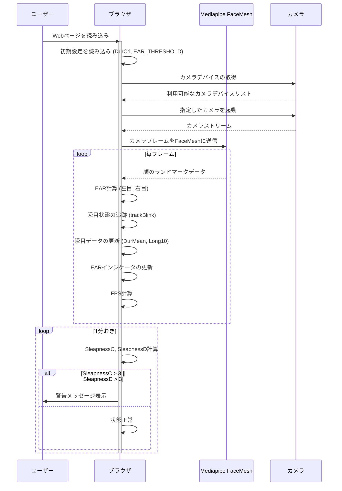

### 

```mermaid
sequenceDiagram
    participant User as ユーザー
    participant Browser as ブラウザ
    participant FaceMesh as Mediapipe FaceMesh
    participant Camera as カメラ

    User->>Browser: Webページを読み込み
    activate Browser
    Browser->>Browser: 初期設定を読み込み (DurCri, EAR_THRESHOLD)
    Browser->>Camera: カメラデバイスの取得
    Camera-->>Browser: 利用可能なカメラデバイスリスト
    Browser->>Camera: 指定したカメラを起動
    Camera-->>Browser: カメラストリーム
    Browser->>FaceMesh: カメラフレームをFaceMeshに送信

    loop 毎フレーム
        FaceMesh-->>Browser: 顔のランドマークデータ
        Browser->>Browser: EAR計算 (左目, 右目)
        Browser->>Browser: 瞬目状態の追跡 (trackBlink)
        Browser->>Browser: 瞬目データの更新 (DurMean, Long10)
        Browser->>Browser: EARインジケータの更新
        Browser->>Browser: FPS計算
    end

    loop 1分おき
        Browser->>Browser: SleapnessC, SleapnessD計算
        alt SleapnessC > 3 || SleapnessD > 3
            Browser->>User: 警告メッセージ表示
        else
            Browser->>Browser: 状態正常
        end
    end

    deactivate Browser
```